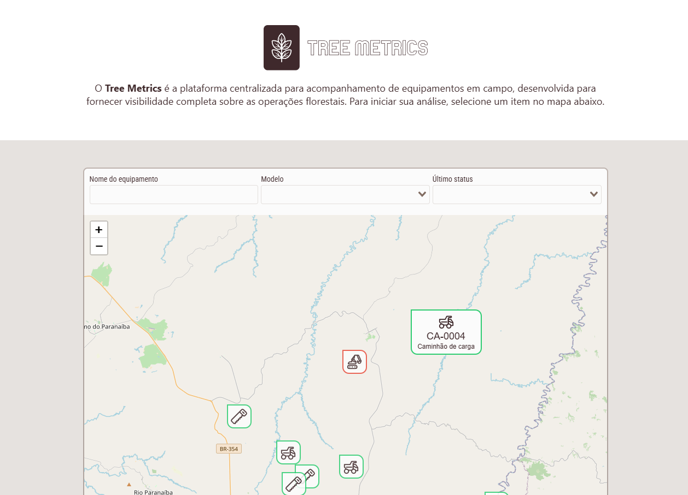
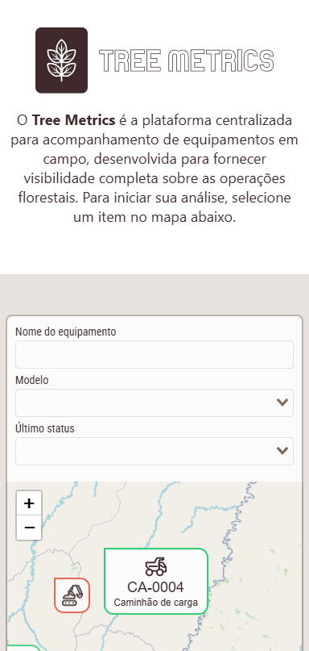
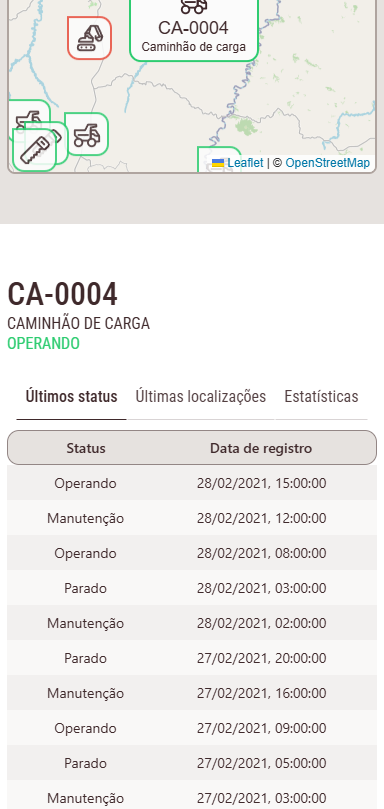
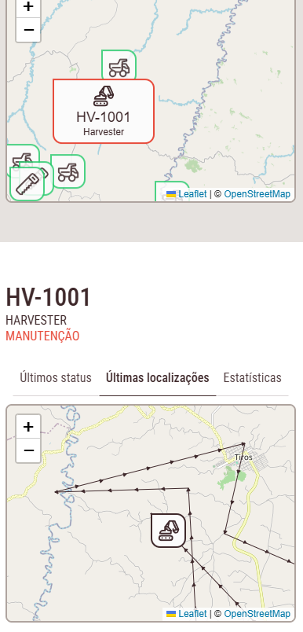

# Tree Metrics

O Tree Metrics é a plataforma centralizada para acompanhamento de equipamentos em campo, desenvolvida para fornecer visibilidade completa sobre as operações florestais.

## Case

Você é o desenvolvedor frontend de uma empresa que coleta dados de equipamentos utilizados em uma operação florestal. Dentre esses dados estão o histórico de posições e estados desses equipamentos. O estado de um equipamento é utilizado para saber o que o equipamento estava fazendo em um determinado momento, seja _Operando_, _Parado_ ou em _Manutenção_. O estado é alterado de acordo com o uso do equipamento na operação, já a posição do equipamento é coletada através do GPS e é enviada e armazenada de tempo em tempo pela aplicação.

Seu objetivo é, de posse desses dados, desenvolver o frontend de aplicação web que trate e exibida essas informações para os gestores da operação.

## Solução

Tree Metrics é uma aplicação Vue 3 + TypeScript criado com Vite que utiliza as seguintes dependências:

### Produção

| Dependência                           | Descrição                                             |
| ------------------------------------- | ----------------------------------------------------- |
| `@fortawesome/fontawesome-free`       | Ícones gratuitos do Font Awesome (CSS/webfont)        |
| `@fortawesome/fontawesome-svg-core`   | Core para usar ícones Font Awesome como SVG           |
| `@fortawesome/free-brands-svg-icons`  | Ícones de marcas (Twitter, Facebook etc.)             |
| `@fortawesome/free-regular-svg-icons` | Ícones no estilo "regular" (contorno)                 |
| `@fortawesome/free-solid-svg-icons`   | Ícones no estilo "solid" (preenchidos)                |
| `@fortawesome/vue-fontawesome`        | Componente Vue para Font Awesome                      |
| `pinia`                               | Gerenciador de estado para Vue 3 (substituto do Vuex) |
| `vue`                                 | Framework Vue.js versão 3                             |
| `vue-router`                          | Sistema de roteamento para SPAs Vue                   |

### Desenvolvimento

| Dependência                | Descrição                           |
| -------------------------- | ----------------------------------- |
| `@tsconfig/node22`         | Configurações TS para Node.js 22    |
| `@types/leaflet`           | Tipos para Leaflet                  |
| `@types/luxon`             | Tipos para Luxon                    |
| `@types/node`              | Tipos para Node.js                  |
| `@vitejs/plugin-vue`       | Plugin do Vite para Vue             |
| `@vue-leaflet/vue-leaflet` | Componentes Vue para mapas Leaflet  |
| `@vue/tsconfig`            | Configurações TS para Vue           |
| `bootstrap`                | Framework CSS/JS                    |
| `chart.js`                 | Biblioteca de gráficos              |
| `cypress`                  | Framework de teste E2E              |
| `leaflet`                  | Biblioteca de mapas interativos     |
| `leaflet-arrowheads`       | Adiciona setas a linhas no Leaflet  |
| `luxon`                    | Manipulação moderna de datas/tempos |
| `npm-run-all2`             | Executa múltiplos scripts npm       |
| `prettier`                 | Formatador de código                |
| `start-server-and-test`    | Inicia servidor e roda testes       |
| `typescript`               | Superset tipado do JavaScript       |
| `vite`                     | Build tool e dev server moderno     |
| `vite-plugin-vue-devtools` | Integra Vue DevTools ao Vite        |
| `vue-chart-3`              | Componentes Vue para Chart.js       |
| `vue-select`               | Componente select avançado          |
| `vue-tsc`                  | Checador de tipos para arquivos Vue |

## Screenshots

### Desktop

### Mobile

